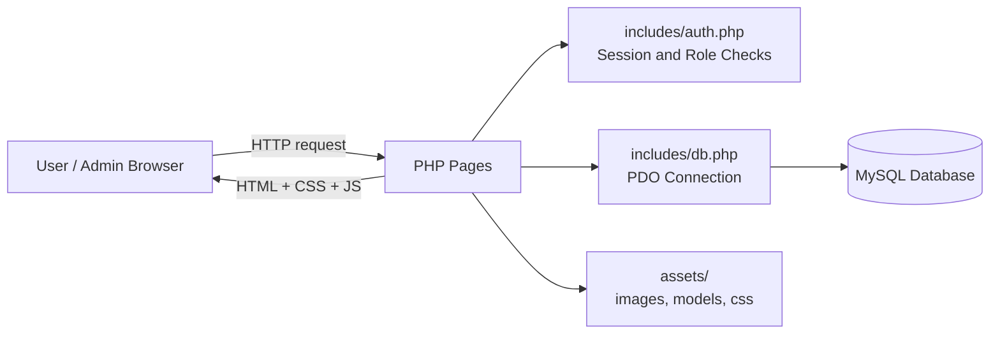
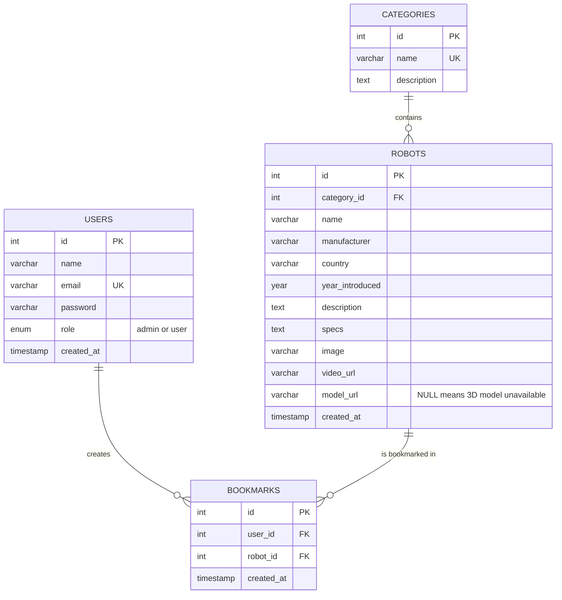
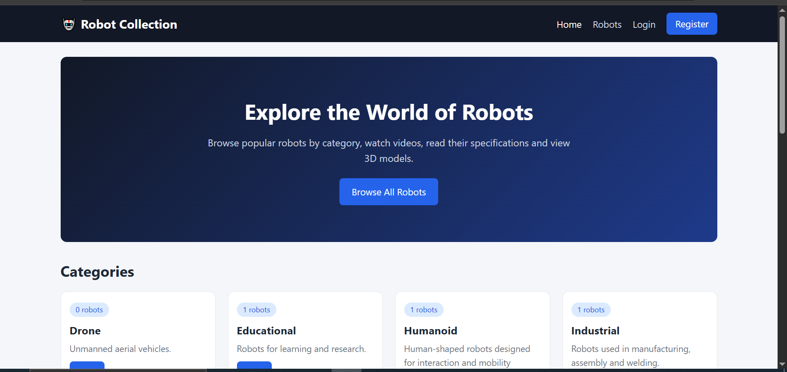
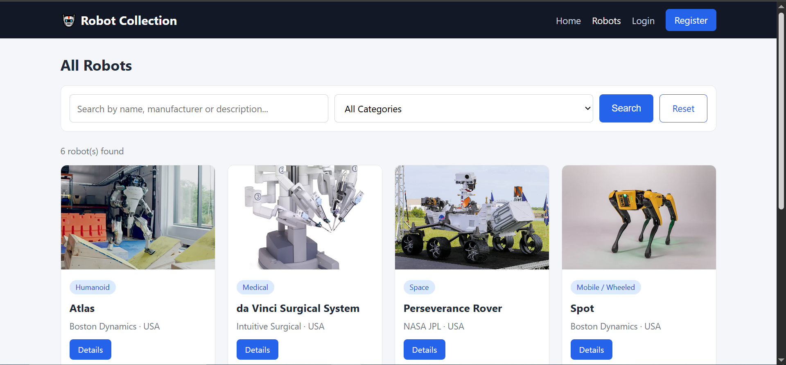
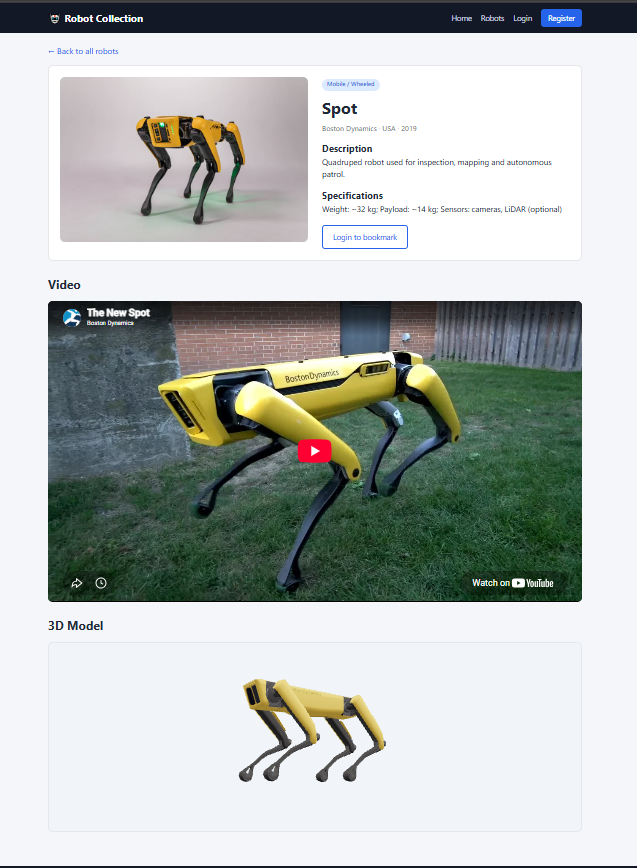
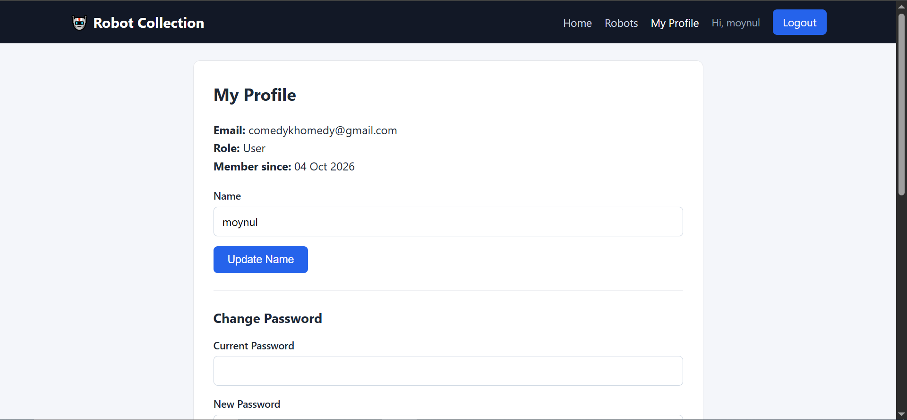
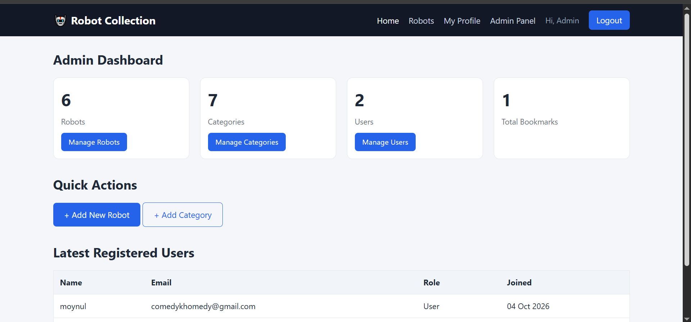
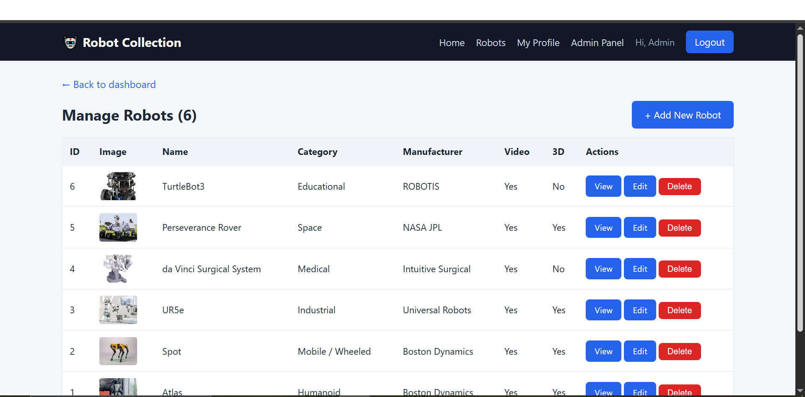

# 🤖 Robot Collection

A full-stack web application for exploring Popular ROBOTS - by category, with detailed specifications, YouTube demonstrations, and interactive 3D model viewing. Includes role-based access control and a complete admin panel.

**🌐 Live Demo:** [robotcollection.infinityfreeapp.com](https://robotcollection.infinityfreeapp.com)


> Final project for the **Web Application Development Lab**, Department of ICT, Mawlana Bhashani Science and Technology University (MBSTU).

---

## 📌 Table of Contents

- [Overview](#-overview)
- [Features](#-features)
- [User Roles](#-user-roles)
- [Tech Stack](#-tech-stack)
- [System Architecture](#-system-architecture)
- [Database Design](#-database-design)
- [Project Structure](#-project-structure)
- [Security](#-security)
- [Screenshots](#-screenshots)
- [Getting Started](#-getting-started)
- [Deployment](#-deployment)
- [Challenges and Solutions](#-challenges-and-solutions)
- [Future Improvements](#-future-improvements)
- [Author](#-author)

---

## 📖 Overview

### Problem
Information about popular robots is scattered across manufacturer sites, videos, and papers. Students and enthusiasts have no single, organised place to browse robots, compare their background, and see them in action.

### Solution
Robot Collection brings this into one structured catalog. Robots are grouped by category (Industrial, Humanoid, Mobile, Drone, Medical, Space, Educational), and each robot has its own page with a description, specifications, a demo video, and an interactive 3D model where available.

### Objectives
- Build a complete multi-page web application with front-end, back-end, and database.
- Implement authentication and role-based authorization (admin / user).
- Provide full CRUD management through an admin panel.
- Apply secure coding practices (hashed passwords, prepared statements, output escaping).
- Deploy the application on a free hosting service with a working live link.

---

## ✨ Features

### For all visitors
- Home page with category overview and latest robots
- Browse all robots in a responsive card layout
- **Search** by name, manufacturer or description
- **Filter** by category (search and filter work together)
- Detailed robot page: description, specifications, manufacturer, country, year
- Embedded **YouTube video** demonstration
- Interactive **3D model viewer** (rotate and zoom). A clear "3D model unavailable" message is shown when a model does not exist

### For registered users
- Registration and login with validation
- **Bookmark** robots and manage them from the profile page
- Profile page: update name, change password, view bookmarks

### For administrators
- Dashboard with live statistics (robots, categories, users, bookmarks)
- **Robots:** add, edit, delete, with image and `.glb` 3D model upload
- **Categories:** add, edit, delete (a category that still has robots cannot be deleted)
- **Users:** view all users, change roles, delete users (admins cannot demote or delete themselves)

### General
- Fully **responsive** design (mobile menu, flexible grids)
- Clean, consistent UI shared through reusable header and footer includes

---

## 👥 User Roles

| Role | Permissions |
|------|-------------|
| **Visitor** | Browse, search, filter, view robot details, register, login |
| **User** | Everything a visitor can do, plus bookmarks and profile management |
| **Admin** | Everything a user can do, plus full management of robots, categories and users |

Access to protected pages is enforced on the server (`require_login()` and `require_admin()`), not only by hiding links.

---

## 🛠 Tech Stack

| Layer | Technology |
|-------|------------|
| Front-end | HTML5, CSS3 (custom responsive stylesheet), JavaScript |
| Back-end | PHP (PDO) |
| Database | MySQL |
| 3D Viewer | Google [`<model-viewer>`](https://modelviewer.dev/) web component |
| Video | YouTube embeds |
| Hosting | InfinityFree (free PHP + MySQL hosting) |
| Version control | Git and GitHub |

---

## 🏗 System Architecture



**Request flow:** the browser requests a PHP page, which loads the shared includes (session/auth and database connection), runs prepared SQL queries, and renders HTML using the shared header and footer.

---

## 🗄 Database Design



- **Categories → Robots:** one-to-many (`ON DELETE RESTRICT`, so categories with robots are protected).
- **Users ↔ Robots:** many-to-many through `bookmarks` (`ON DELETE CASCADE`, so bookmarks are cleaned up automatically).
- A unique key on `(user_id, robot_id)` prevents duplicate bookmarks.

---

## 📁 Project Structure

```
robot_collection/
├── index.php              # Home page
├── robots.php             # Robot list with search and category filter
├── robot.php              # Robot details, video, 3D viewer, bookmark
├── register.php           # User registration
├── login.php              # Login
├── logout.php             # Logout
├── profile.php            # Profile, change password, bookmarks
├── database.sql           # Schema and sample data
├── includes/
│   ├── db.php             # PDO database connection
│   ├── auth.php           # Session, role checks, output escaping helper
│   ├── header.php         # Shared navbar and page head
│   └── footer.php         # Shared footer
├── assets/
│   ├── css/style.css      # Responsive stylesheet
│   ├── images/            # Robot images (uploaded via admin panel)
│   └── models/            # 3D models in .glb format
└── admin/
    ├── index.php              # Dashboard
    ├── manage_robots.php      # Robot list and delete
    ├── robot_form.php         # Add / edit robot
    ├── manage_categories.php  # Category CRUD
    └── manage_users.php       # User management
```

---

## 🔒 Security

- **Password hashing:** `password_hash()` and `password_verify()`; plain-text passwords are never stored.
- **SQL injection protection:** all queries that use user input are PDO prepared statements.
- **XSS protection:** all dynamic output passes through an `e()` helper (`htmlspecialchars`).
- **Session security:** `session_regenerate_id()` on login; full session destruction on logout.
- **Authorization:** admin pages are guarded server-side; the role is never taken from user input (registration always creates a `user`).
- **Safe file uploads:** extension whitelist, size limits, real image verification with `getimagesize()`, `.glb` magic-byte check, and randomised file names.
- **Destructive actions** (delete, role change) accept POST requests only and ask for confirmation.

---

## 📸 Screenshots

| Home | Robots (search and filter) |
|------|---------------------------|
|  |  |

| Robot details with 3D viewer | User profile |
|------------------------------|--------------|
|  |  |

| Admin dashboard | Admin: manage robots |
|-----------------|----------------------|
|  |  |

---

## 🚀 Getting Started

### Prerequisites
- [XAMPP](https://www.apachefriends.org/) (or any PHP 7.4+ and MySQL environment)

### Local setup

1. **Clone the repository** into your web root (for XAMPP: `C:\xampp\htdocs\`):
   ```bash
   git clone https://github.com/E-Moynul/robot_collection.git
   ```
2. **Start Apache and MySQL** from the XAMPP control panel.
3. **Create the database:** open `http://localhost/phpmyadmin`, then import `database.sql`. It creates the `robot_collection` database, all tables, and sample data.
4. **Configure the connection** in `includes/db.php`:
   ```php
   $host   = 'localhost';
   $dbname = 'robot_collection';
   $user   = 'root';
   $pass   = '';
   ```
5. **Open the app:** `http://localhost/robot_collection/`

### Default admin account (from `database.sql`)

| Email | Password |
|-------|----------|
| `xxxx` | `xxxx` |

> ⚠️ Change this password immediately after the first login (Profile → Change Password).

New users registering through the site are always created with the `user` role. An admin can promote users from **Admin → Manage Users**.

---

## 🌍 Deployment

The live site runs on **InfinityFree**:

1. Create a hosting account and a MySQL database.
2. Import `database.sql` with phpMyAdmin (remove the `CREATE DATABASE` and `USE` lines, since the database already exists on shared hosting).
3. Update `includes/db.php` with the host, database name, username and password provided by the host.
4. Upload all project files into `htdocs/` (so that `index.php` is directly inside `htdocs`).

---

## 🧩 Challenges and Solutions

| Challenge | Solution |
|-----------|----------|
| Many robots have no freely available 3D model | `model_url` is nullable; the page shows a clear "3D model unavailable" state instead of breaking |
| Admins paste different YouTube link formats | A helper extracts the video ID from `watch`, `youtu.be` and `embed` links and builds the embed URL |
| Protecting data integrity when deleting | Foreign keys with `RESTRICT` for categories and `CASCADE` for bookmarks, plus an application-level check |
| Safe file uploads on shared hosting | Whitelist, size limit, content verification and renamed files |
| Free hosting limitations | Videos are embedded from YouTube instead of hosted; images are kept small |

---

## 🔮 Future Improvements

- Robot comparison tool (side-by-side specifications)
- Ratings and reviews
- ROS / ROS2 support tag and filter
- Pagination and advanced sorting
- Robotics history timeline page
- Contributor role: users submit robots, admins approve
- CSRF tokens and login rate limiting
- REST API for the robot catalog

---

## 👤 Author

**Moynul Rifat**
BSc Engineering (ICT), Mawlana Bhashani Science and Technology University (MBSTU), Bangladesh

- GitHub: [@E-Moynul](https://github.com/E-Moynul)
- Portfolio: [e-moynul.github.io](https://e-moynul.github.io)

### Acknowledgements
- 3D viewing powered by Google's [`<model-viewer>`](https://modelviewer.dev/).
- 3D models and robot images are credited to their original creators and sources (for example Sketchfab and NASA 3D Resources) under their respective licenses.
